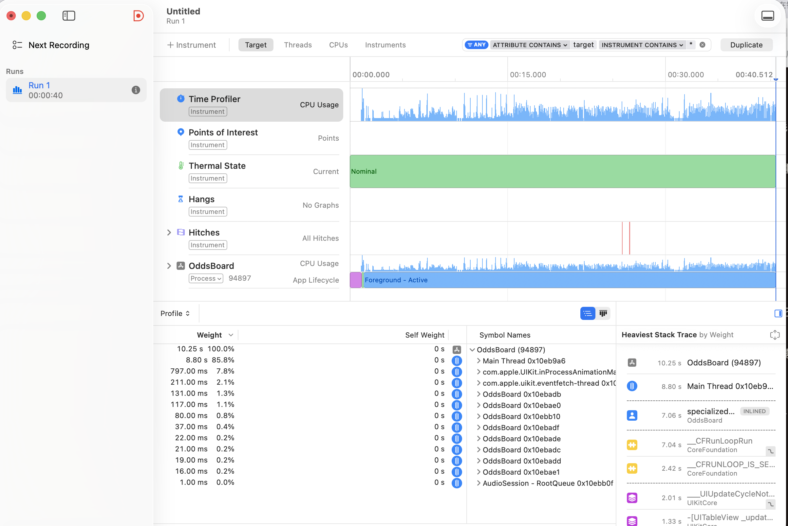
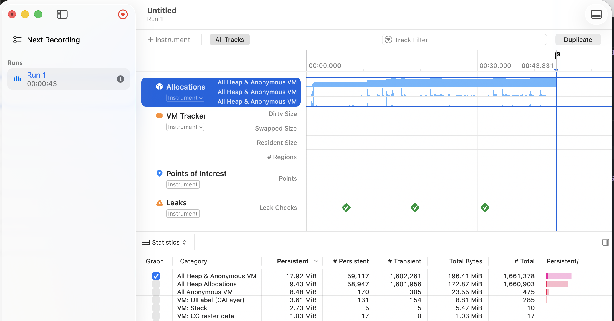

# 架構說明

> 回答作業要求的三個問題（§2、§3、§4），並在 §7 列出已知限制與未完成部分。
> 完整需求與每條需求的來源標記見 [`docs/spec.md`](docs/spec.md)。

---

## 1. 這個專案在解什麼問題

一個賠率看板要同時滿足兩件互相拉扯的事：**資料要即時**（推播每秒數十至數百筆，
畫面上的數字必須是現值），**畫面要順**（使用者正在滾動，任何多餘的重繪都會被看見）。

核心主張：

> **UI 的更新頻率應該由畫面的刷新節奏決定，而不是由資料的到達節奏決定。**

推播進來多快是外界決定的，畫面畫多快是我們決定的。§5 說明如何用三層機制把兩者解耦。

---

## 2. Swift Concurrency 與 Combine 分別用在哪裡

> **跨執行緒存取狀態 → Swift Concurrency。狀態變動通知 UI → Combine。**

| 場景 | 用什麼 | 為什麼不是另一個 |
|---|---|---|
| 共享賠率狀態的保護 | `actor OddsStore` | Combine 不提供資料隔離保證，它是事件傳遞而非同步機制 |
| 模擬 WebSocket 事件流 | `AsyncStream<OddsStreamEvent>` | 取消語意跟著 `Task` 走，不需額外管理訂閱生命週期 |
| API 請求 | `async throws` | 錯誤即 `throw`，不必處理 `Publisher` 的完成/失敗雙通道 |
| ViewModel → ViewController 綁定 | Combine `@Published` + `sink` | UIKit 無自動重繪，Combine 是綁定最短路徑 |
| 高頻更新的節流 | 自製 `UpdateCoalescer`，不用 `Combine.throttle` | `throttle` 在視窗內**丟棄**事件，會連帶丟掉其他場次的更新；我們要的是**合併**（ID 取聯集、值取最新），沒有任何一場的更新會遺失 |

`UpdateCoalescer` 不是 actor：它由 `@MainActor` 的 ViewModel 獨佔持有，不存在跨執行緒
存取，做成 actor 只會每幀多付一次 hop、沒有安全性收益。

---

## 3. 如何確保資料存取 thread-safe

```
      推播 Task ─┐
                 ├──→  actor OddsStore  ──→  @MainActor ViewModel  ──→  UIKit
    重連對帳 Task ┘      （唯一可變狀態）        （@Published）
```

`actor OddsStore` 是全 App **唯一**持有可變賠率狀態的地方，沒有第二份副本、
沒有 `NSLock`、沒有 concurrent queue + barrier。

**為什麼是 actor 不是 queue + barrier**：barrier 的正確性靠每一個呼叫端自律，
漏一處就是資料競爭，且編譯器不會警告。actor 把「同一時間只有一個執行緒能碰這份狀態」
變成**編譯期**保證。`.swiftlint.yml` 把 `NSLock` / `DispatchSemaphore` 設成 error，
確保這個決定不會被繞過。

ViewModel 標記 `@MainActor`，因此每次跨界都必然是 `await`——邊界在型別系統上一目了然，
不散落 `Task { @MainActor in }`。

**亂序更新的仲裁**：作業的推播 payload 沒有時間戳也沒有序號。單一來源下看似無害，
但一旦有並行處理或重連補資料，後到的舊資料覆蓋新資料就是必然發生的 bug。
Mock 層補上單調遞增的 `sequence`，store 只接受比目前值新的更新：

```swift
if let accepted = acceptedSequence[update.matchID], update.sequence <= accepted {
    return false   // 舊資料，丟棄
}
```

重連對帳（`replaceAll(with:)`）覆寫後會把所有場次的序號基準推到當下已知的最高序號，
避免斷線前仍在飛行中的舊推播在對帳完成後才抵達、蓋掉剛校正好的值。

**驗證**：`OddsStore` 有並發壓力測試（多 Task 同時寫入，結果確定無 crash）與亂序丟棄測試；
編譯設定 `-strict-concurrency=complete`。

---

## 4. UI 與 ViewModel 如何綁定

```
App target                  Composition Root。唯一組裝具體型別的地方
Packages/OddsUI              View。UIKit / SnapKit
Packages/OddsPresentation    ViewModel。可用 Combine，禁 UIKit
Packages/OddsCore             Domain + Data。零第三方相依，禁 UIKit
```

依賴方向永遠向下，跨層一律走 protocol。這四層是四個 SPM module ——
「Domain 不得依賴 UI」因此是編譯期保證：`OddsCore` 與 `OddsPresentation` 同時宣告
支援 macOS，一旦 `import UIKit`，macOS 平台立刻編譯失敗。附帶效益是這兩層的測試
不需要模擬器，`swift test` 數秒跑完，ViewModel 因此能被快速迭代地測。

**綁定**：ViewModel 以 `@Published` 對外發布，ViewController 在 `bind()` 一處集中接線。
兩個值得注意的設計：

- `orderedMatchIDs`（順序）與賠率內容分開發布 —— 賠率變動不改變順序，
  diffable snapshot 因此只在載入時 apply 一次，賠率更新永遠走 `reconfigureItems`。
- 連線狀態與對帳結果用 `CombineLatest` 併成一條線，避免後到的把先到的訊息蓋掉。

UIKit 沒有自動重繪，每個要上畫面的狀態都得明確接一條線；漏接的症狀是
**「單元測試全綠、畫面卻不動」**——因為測試驗的是 ViewModel 的內部狀態，
而 bug 在「狀態到畫面」那一段。本專案為此踩過三次（漲跌閃爍、對帳結果、
對帳失敗提示），`bind()` 開頭因此留了一段提醒。

---

## 5. 核心：賠率更新為什麼不會整頁 reload

關鍵洞察：**賠率變動不改變 cell 的身分，也不改變排序**，因此 snapshot 順序不變，
不需要一次帶動畫的 diff apply，只需要「同一個 cell 的內容重設」。

**三層防護：**

1. **identifier 只放 matchID**（`UITableViewDiffableDataSource<Section, Int>`）。
   若 identifier 含賠率，賠率一變 hash 就變，diffable 會判定為「刪一列 + 插一列」。
2. **只更新目前可見的列**。100 場比賽、螢幕只看得到約 10 列 ⇒ 約九成的推播
   不該碰 UI，看不見的列使用者滾到時 `cellProvider` 自然拿到新值。
3. **更新合併，由 `CADisplayLink` 對齊幀邊界觸發**（100ms 一拍）。
   1000 筆/秒的推播 → UI 每秒最多 10 次批次更新，且同一場在一個視窗內
   連續變動多次只會被畫一次。

`reconfigureItems` 是關鍵 API：它保留既有 cell 實體，只重跑 cellProvider ——
這是「不整頁 reload」與「不刪列再插列」之間的那條路，也是 deployment target
訂在 iOS 16 的原因（此 API 需 iOS 15+）。

漲跌閃爍（綠底/紅底、0.6 秒淡出）不只是美觀，它讓「只有那一格在動、整頁沒有重繪」
肉眼可驗證。排序鍵為 `(startTime, matchID)` 複合鍵，確保時間相同的場次順序穩定；
比賽開始後不重新排序，避免使用者滾到一半列表自己跳動。

### 實測（iPhone ProMotion 機種實機，推播加壓至 1000 筆/秒並持續滾動 40 秒）

| 指標 | 實測 | 判準 |
|---|---|---|
| Animation Hitches | 2 次，共 33.34ms → **0.82 ms/s** | Apple 的「良好」門檻為 < 5 ms/s |
| Hangs | **0** | — |
| 主執行緒 CPU | **22%** | 無 > 16ms 的同步區塊 |
| 記憶體 | persistent **17.92 MiB**，前 10 秒後走平 | 不隨時間成長 |
| 物件回收 | 166 萬次配置，**96.4% 為短命物件** | — |
| Leaks | **零洩漏**（三次檢查） | — |

兩次 hitch 的 min/avg/max 完全相同（皆 16.67ms，即一個 vsync），且集中在同一時刻
—— 是切換推播頻率那一瞬間錯過一次 vsync，不是持續性掉幀。

<details>
<summary>Instruments 截圖（點開）</summary>

**Time Profiler + Animation Hitches**

主執行緒的 heaviest stack 全是 UIKit 的正常運作（`__CFRunLoopRun` →
`_UIUpdateCycleNotify` → `-[UITableView _updat…]`），`flushPendingUpdates`
未進入前列。Hangs 無圖表、Thermal State 全程 Nominal。



**Allocations + Leaks**

Persistent 曲線在前 10 秒爬升後走平；Leaks 三次檢查全綠。
`VM: UILabel (CALayer)` 停在 131 persistent —— cell 重用正常，
沒有隨滾動累積。



</details>

> 註：iOS 15 起 App 在 ProMotion 裝置上預設仍以 60fps 渲染。本專案刻意不加入
> `CADisableMinimumFrameDurationOnPhone`：UI 更新已由 `CADisplayLink` 節流到
> 100ms（10Hz），120Hz 渲染對賠率看板沒有意義，只會多耗電。
> **架構本身已經把資料頻率與畫面頻率解耦，不需要靠拉高刷新率來救。**

---

## 6. 加分項摘要

| 情境 | 機制 | 說明 |
|---|---|---|
| 同一次啟動內切換畫面（push/pop） | ViewModel 由 view controller 持有，不重建 | 這是**所有權**問題，不是快取問題 |
| App 冷啟動 | `FileSnapshotCache`（磁碟 JSON，原子替換寫入） | 這才是磁碟快取唯一有意義的舞台 |
| WebSocket 斷線重連 | 指數退避 + 抖動（1s→30s 上限，8 次後停止） | 抖動避免所有客戶端同時打回剛恢復的伺服器 |
| 重連後 | **全量對帳**：重抓 `GET /odds` 並走一般 flush 路徑抵達畫面 | 斷線期間的推播永久遺失，只重連不對帳會讓部分場次永遠停在舊值 |

過期快取（超過 10 分鐘）仍顯示但加警示橫幅 —— 直接拿舊賠率當現值在博弈情境是
最危險的一類錯誤。對帳失敗與連線失敗分開表達，因為對帳失敗時推播其實是好的。

反過來，**載入失敗時會一併中斷推播**：`loadState == .failed` 必須等價於
「畫面上沒有任何即時資料在流動」，否則會出現狀態列寫著失敗、賠率卻仍在跳動的
矛盾畫面，而使用者無從判斷哪個才是真的。

Debug 面板（導覽列右上角按鈕）可加壓到 1000 筆/秒、模擬斷線、模擬載入失敗；HUD 常駐顯示
`推播/套用/丟棄/UI 批次數/p95 延遲/reloadData 次數`，把驗收條件變成可視化證據。

---

## 7. 已知限制與未完成的部分

以下每一項都是**知道、可以修、判斷不修**，或**確實還沒做**：

- **`MockOddsSocket` 的連線狀態事件與賠率資料共用同一條會丟棄的緩衝**
  （`bufferingNewest(256)`）。極高負載下狀態事件理論上可能被一起丟掉。
  正解是控制事件走獨立、不丟棄的通道。這是目前最不滿意的一處設計，未修的原因是
  mock 環境下觸發不到，且需要改動 `OddsStreaming` 的介面形狀。
- **HUD 的「丟棄」欄位在目前架構下恆為 0，而且它量不到緩衝溢位的丟失。**
  該欄位統計的是「抵達 store 但因序號過舊而被拒絕」的筆數；mock 的序號由單一
  actor 單調產生、`AsyncStream` 保序、消費端唯一，因此結構上不可能亂序，恆為 0
  是正確的（序號仲裁防的是真實環境的亂序抵達）。但若事件在緩衝溢位時被丟掉，
  那些推播根本不會進入 `received`，等於**連漏了都不知道**。
  要讓這個欄位有意義，得由推播來源回報「已送出總數」，與消費端收到的數量對帳。
- **`OddsStore.replaceAll` 未清掉不在新資料中的比賽的狀態**。本專案比賽集合固定，
  不會觸發；接上真實 API（比賽會結束/新增）就必須補上，否則是緩慢的記憶體洩漏。
- **導覽列 Debug 按鈕會在 console 留下一則 Auto Layout 約束衝突警告。**
  衝突發生在 UIKit 私有型別之間（`NavigationButtonBar.ItemWrapperView.width == 0`
  對上 `_UIModernBarButton` 的內外距），本專案沒有對該按鈕下任何約束，
  換成純文字標題也只是讓內距從 2pt 變 12pt、衝突照舊。UIKit 會自行 recover
  （訊息明言 `Will attempt to recover`），視覺與互動皆正常。
  能消除它的作法是改用 `UIBarButtonItem(customView:)` 自行控制尺寸，
  但那等於為了一則警告去繞過系統元件、並失去標準的 bar button 間距，
  判斷不划算。
- **local SPM package 測試無法從 Xcode ⌘U 執行**，需 `swift test` 命令列跑
  （見 README）。轉 `.xcworkspace` 可解，換來的只是 ⌘U 便利性，選擇不轉。
- **沒有 CI**。所有閘門（lint、測試、Thread Sanitizer）僅本機執行。
- **接上正式環境需要改的**：網路層換 `URLSession`/`URLSessionWebSocketTask`
  （Presentation 層不必改，只認識 protocol）；序號改由伺服器下發；對帳改增量而非全量；
  快取視資料量換成資料庫；補上分類錯誤處理與無障礙支援（accessibilityValue、
  VoiceOver 通知）。
- **範圍外（`docs/spec.md` §1 已明確排除）**：深色模式適配、多語系、下注/金流、登入。
  UI 使用 semantic color，深色模式實際可用但未逐一檢查對比度。

驗證方式（Instruments 檢查清單、錄影腳本）見 [`docs/verification.md`](docs/verification.md)。
